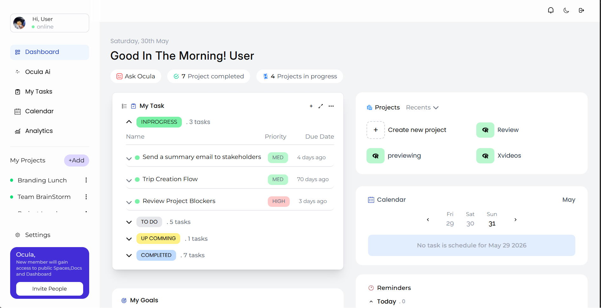
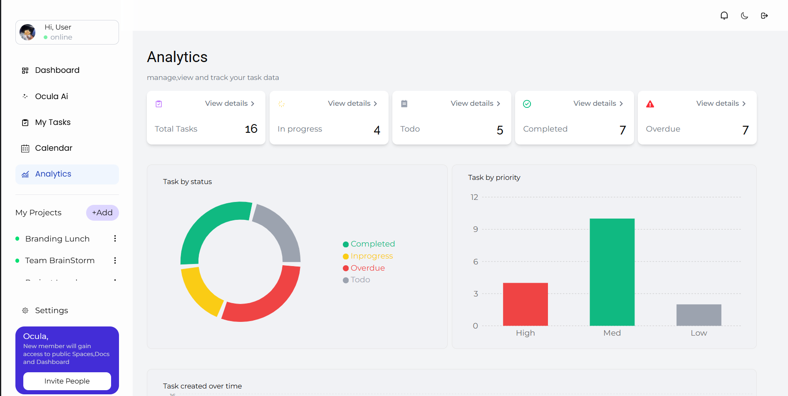
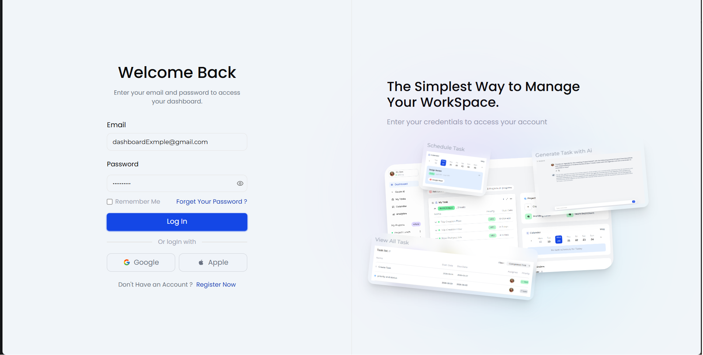
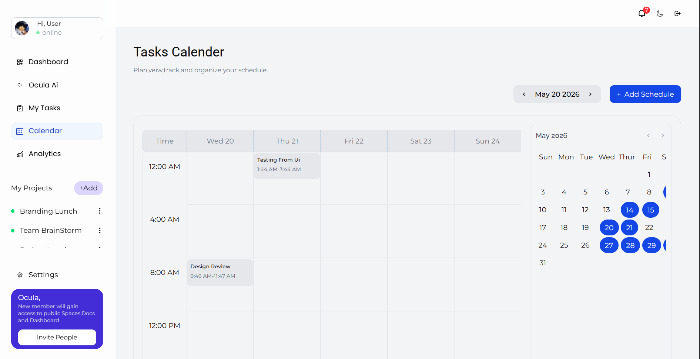
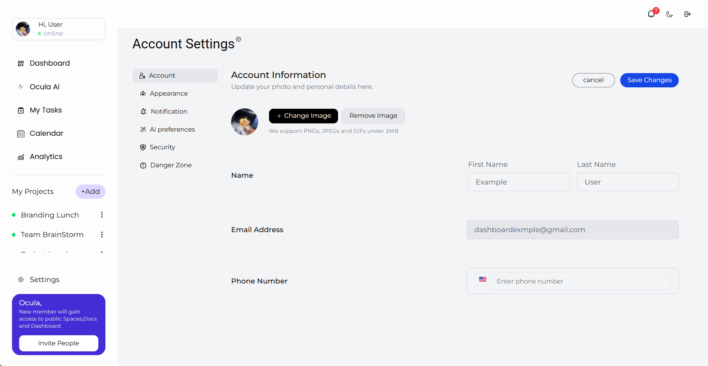
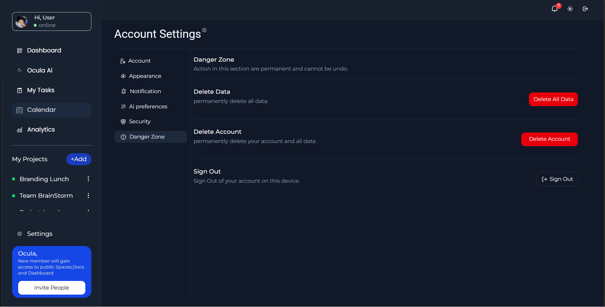
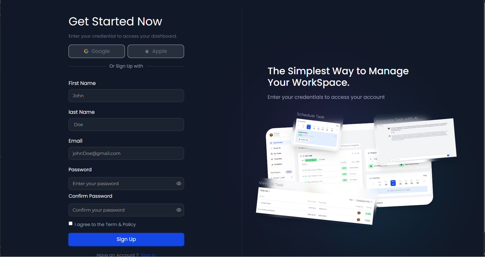
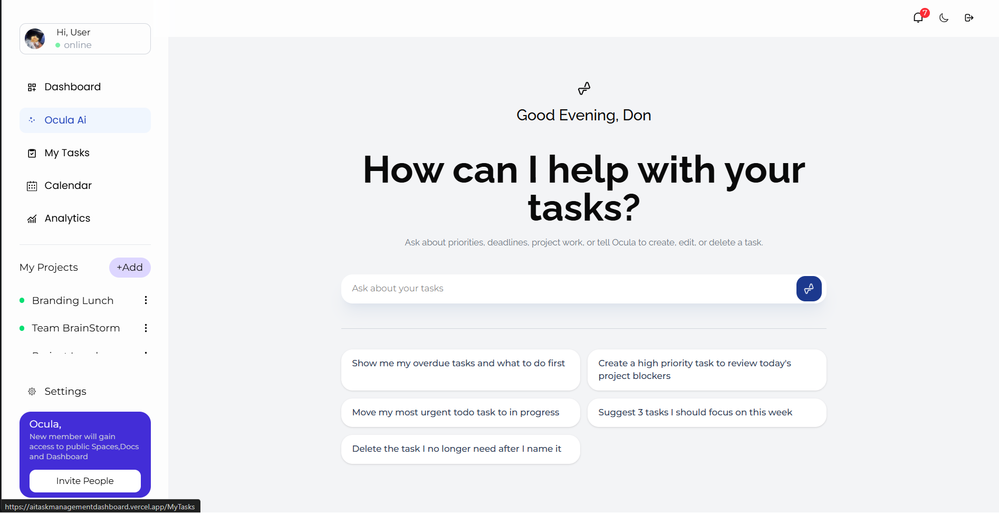
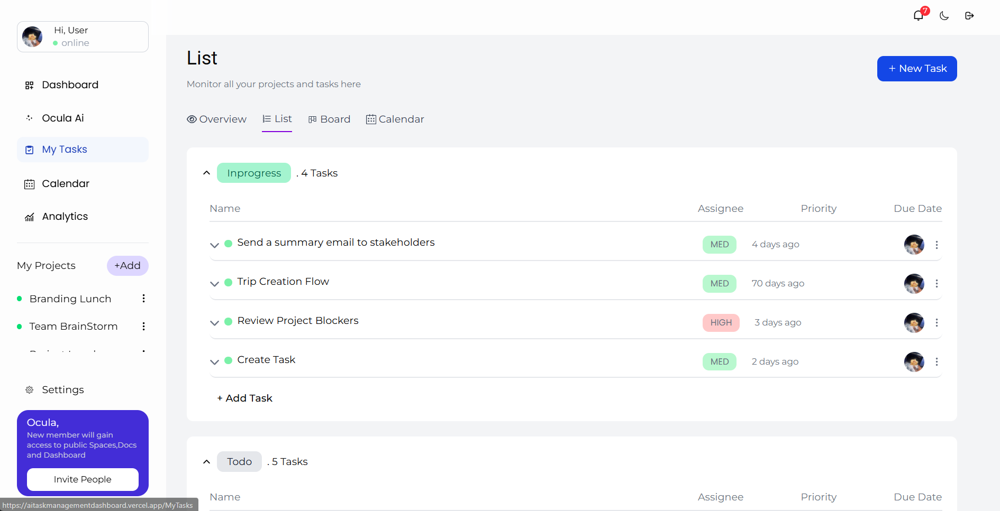
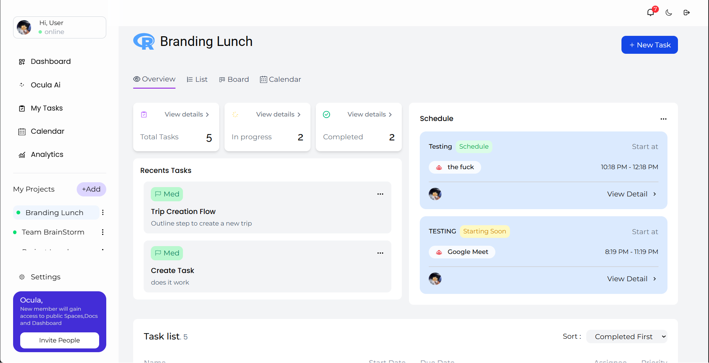

# Ocula — AI Task Management Dashboard

A full-stack productivity dashboard for managing tasks, schedules, and projects — powered by AI suggestions and built with React, TypeScript, and Supabase.

🔗 **Live Demo:** [aitaskmanagementdashboard.vercel.app](https://aitaskmanagementdashboard.vercel.app)

---

## Screenshots












---

## Features

### ✅ Task Management

- Create, read, update, and delete tasks
- Assign tasks to projects or keep them standalone
- Set priority levels (High, Medium, Low) and statuses (Todo, In Progress, Completed)

### 📅 Schedule & Calendar

- Schedule tasks and events with start and end dates
- View scheduled events in a calendar view
- Set reminders for events
- View and dismiss notifications from the notification panel

### 🤖 AI Suggestions

- Get AI-powered task suggestions based on your existing tasks
- Powered by Groq (Llama 3) — free and fast

### 📁 Projects

- Create and manage projects
- Link tasks to specific projects
- View project-specific analytics and task breakdowns

### 📋 My Tasks — Multiple Views

- **Overview** — stats, recent tasks, and schedule at a glance
- **List** — full task list with filters
- **Kanban Board** — drag and drop tasks to change their status

### 📊 Analytics

- Tasks by status (donut chart)
- Tasks by priority (bar chart)
- Tasks created over time (area chart)
- Completion rate by priority (bar chart)
- Overall completion rate progress bar

### ⚙️ Settings

- **Account** — update your name and upload a profile avatar
- **Appearance** — toggle dark/light mode
- **Security** — change your password (with current password verification)
- **Danger Zone** — delete all data or permanently delete your account

### 🔐 Authentication

- Email and password sign up / login
- Google OAuth (with account picker)
- Secure session management via Supabase Auth
- OTP email verification

### 🌙 Dark Mode

- Full dark mode support across all pages

---

## Tech Stack

| Category      | Technology                                         |
| ------------- | -------------------------------------------------- |
| Frontend      | React 19, TypeScript                               |
| Styling       | Tailwind CSS v4                                    |
| Routing       | React Router v7                                    |
| Data Fetching | TanStack React Query                               |
| Backend       | Supabase (Database, Auth, Storage, Edge Functions) |
| AI            | Groq API (Llama 3)                                 |
| Animation     | Framer Motion                                      |
| Charts        | Recharts                                           |
| Forms         | React Hook Form                                    |
| Deployment    | Vercel                                             |

---

## Getting Started

### Prerequisites

- Node.js 18+
- A Supabase project
- A Groq API key (free at [console.groq.com](https://console.groq.com))

### Installation

```bash
# Clone the repo
git clone https://github.com/Donabest/Ocula-Dashboard.git

# Navigate into the project
cd Ocula-Dashboard

# Install dependencies
npm install

# Create your environment file
cp .env.example .env
```

### Environment Variables

Create a `.env` file in the root of the project:

```env
VITE_SUPABASE_URL=your_supabase_url
VITE_SUPABASE_PUBLISHABLE_KEY=your_supabase_publishable_key
VITE_GROQ_API_KEY=your_groq_api_key
```

### Run Locally

```bash
npm run dev
```

---

## Database Setup

Run the following in your Supabase SQL editor to set up RLS policies:

```sql
-- Tasks
ALTER TABLE tasks ENABLE ROW LEVEL SECURITY;
CREATE POLICY "Users can only access their own tasks"
ON tasks FOR ALL TO authenticated
USING (auth.uid() = user_id);

-- Schedules
ALTER TABLE "SchedulesTask" ENABLE ROW LEVEL SECURITY;
CREATE POLICY "Users can only access their own schedules"
ON "SchedulesTask" FOR ALL TO authenticated
USING (auth.uid() = user_id);

-- Projects
ALTER TABLE projects ENABLE ROW LEVEL SECURITY;
CREATE POLICY "Users can only access their own projects"
ON projects FOR ALL TO authenticated
USING (auth.uid() = user_id);
```

---

## Deployment

This project is deployed on **Vercel**. To deploy your own:

1. Push your code to GitHub
2. Connect your repo to [Vercel](https://vercel.com)
3. Add your environment variables in Vercel dashboard
4. Deploy!

---

## Author

**Don**

- Twitter: [@donftp](https://twitter.com/donfttp)
- GitHub: [@Donabest](https://github.com/Donabest)

---

## License

MIT License — feel free to use this project as inspiration for your own!
